# GIS and Humanities lecture

## Outline

- Introduction
- Theoretical Introduction
- Motivation
- Practical Example
- Discussion
- Homework

## Introduction

### Main Idea

This is meant to be a 2 hours course of GIS for humanities students. In the first half, the lecture covers the theoretical basics of cartography, map visualization with a short practical task in the second half

### Requirements

- [QGIS](https://www.qgis.org/en/site/) installed
  - recommended is the STANDALONE STABLE version
- internet connection

---

## Theoretical Introduction

### GIS, Cartography, Geoinformatics, Remote Sensing, Map

- **GIS**

  - ~ Geospatial
  - 1.Geographical Information SCIENCE

    - Scientific discipline

    <figure class="image">
      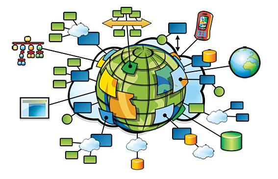
      <i><figcaption>GIS illustration. Taken from <a href="www.esri.com/news/arcnews/winter0809articles/gis-geography-in-action.html">ESRI blog</a>.</figcaption></i>
    </figure >

  - 2.Geographical Information SYSTEMS

    - Software / General tools - [ArcGIS](https://www.arcgis.com/index.html), [QGIS](<(https://www.qgis.org/en/site/)>)
    - Built-in systems
    - Frameworks / libraries for data manipulation, visualization...

    <figure class="image">
      
      <i><figcaption>ArcGIS software random screenshot. Taken from <a href="https://www.youtube.com/watch?v=UZDGcIjLISI">Youtube</a>.</figcaption></i>
    </figure >

- **Cartography**

  - "Drawing" maps of geographical space
  - more "conservative" term
  - mathematical cartography, visualization, theoretical cartography...

    <figure class="image">
      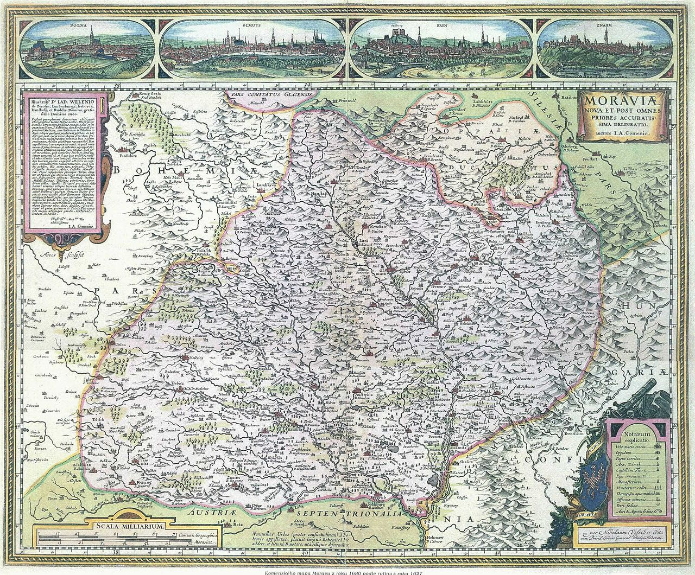
      <i><figcaption>Map of Margraviate of Moravia, made by Komensky in ~1624. Taken from <a href="https://cs.wikipedia.org/wiki/Komensk%C3%A9ho_mapa_Moravy">Wikipedia</a>.</figcaption></i>
    </figure >

- **Geoinformatics**

  - ~ Geomatics
  - heavy use of IT
  - scripting the methods
  - geospatial data analysis, web-based maps, localisatio services

    <figure class="image">
      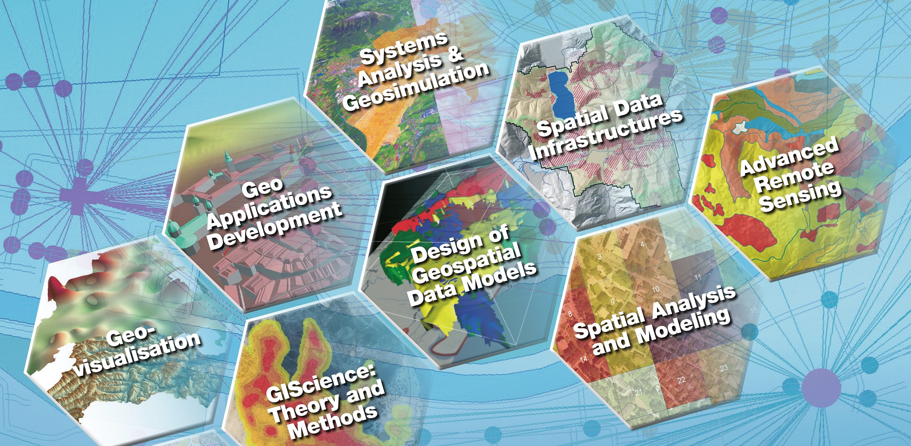
      <i><figcaption>Areas of Geoinformatics. Taken from <a href="https://zgis.at/wp-content/uploads/2017/10/MSc-Banner-Waben_1.jpg">zgis.at</a>.</figcaption></i>
    </figure >

- **Remote sensing**
  - Processing satelite images
    <figure class="image">
      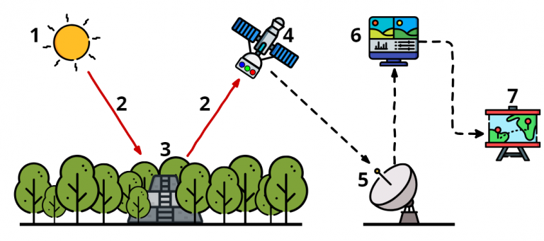
      <i><figcaption>Illustration of Remote Sensing process. Taken from <a href="www.flaticon.com">www.flaticon.com</a> and <a href="https://paititi.info/research-technology/remote-sensing-from-space/">Remote sensing from space</a>.</figcaption></i>
    </figure >

### GIS data sources

- Two types of data

  - **Raster data**
    - Pixel based
    - Formats - png, tiff, jpg...
    - Spatially continuous information - satellite images, elevation, land cover, temperature
    - Topology: points, lines, polygons
  - **Vector data**
    - Defined by coordinates / mathematically
    - Formats - shp, geojson, pdf, svg
    - Topology - points, lines, polygons
    - Spatially discrete information - points of interest, rivers / streets / borders, regions

  <figure class="image">
    
    <i><figcaption>A graphical depiction of vector and raster layers.</figcaption></i>
  </figure >

- Layers
  <figure class="image">
    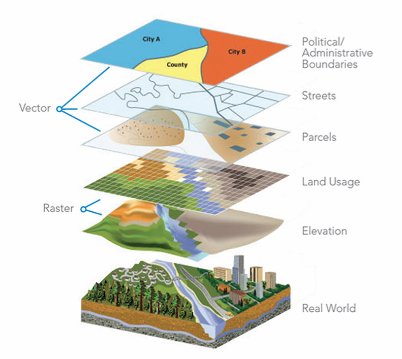
    <i><figcaption>GIS layers.</figcaption></i>
  </figure >

### Spatial Analysis

- Manipulating (filtering, extending, combining) of datasets to create a new dataset
- Map algebra (rasters) - manipulating values in rasters
- Geostatistics - using

<figure class="image">
  
  <i><figcaption>Map by Dr. John Snow of London, showing clusters of cholera cases in the 1854 Broad Street cholera outbreak. Taken from <a href="https://en.wikipedia.org/wiki/Spatial_analysis">wikipedia</a>.</figcaption></i>
</figure >

### Visualization Basics

- Data
  - Categorical / Qualitative - dominant crop
  - Numerical / Quantitative - temperature in grades
  - Boolean - areas with snow
  - Ordinal - position in a ranking
- Graphical variables
  - Size
  - Shape
  - Color hue / value / saturation
  - Orientation

<figure class="image">
  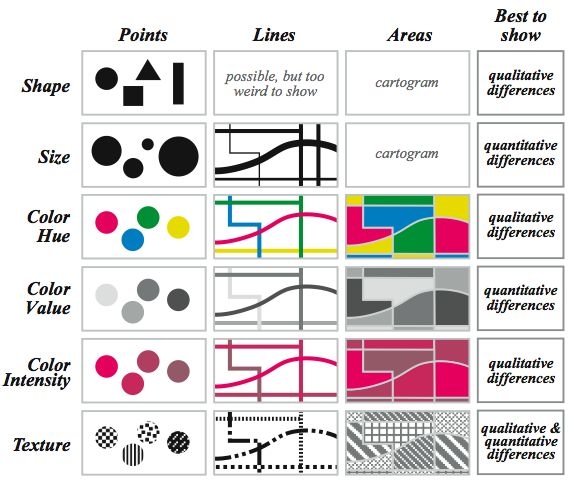
  <i><figcaption> Visual variables and their ideal use, by Bertin.</figcaption></i>
</figure >

- Point symbols
  - Simple
  - Glyphs

<figure class="image">
  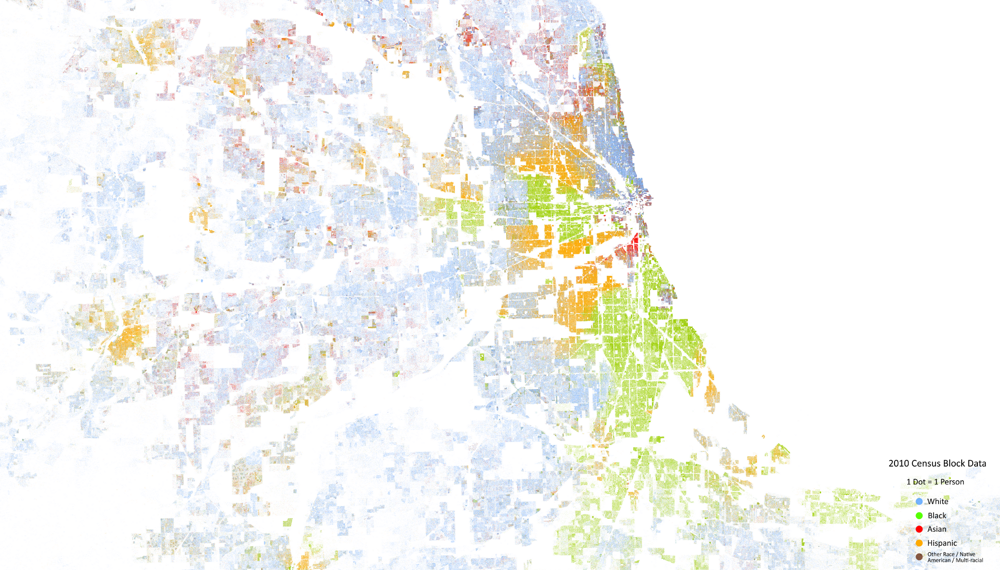
  <i><figcaption>Demography of USA visualized by point symbols. Taken from <a href="https://demographics.virginia.edu/DotMap/">https://demographics.virginia.edu/DotMap/</a>.</figcaption></i>
</figure >
<figure class="image">
  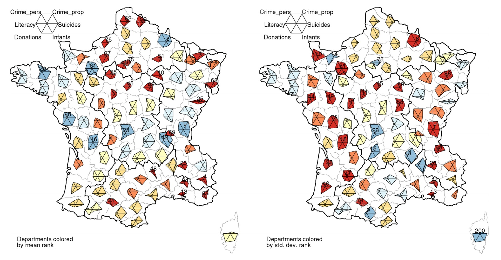
  <i><figcaption>Example of a map using a multivariate point symbols. Taken from <a href="https://projecteuclid.org/download/pdfview_1/euclid.ss/1199285037">A.-M. Guerry’sMoral Statistics of France: Challenges for MultivariableSpatial Analysis</a>.</figcaption></i>
</figure >

- Line symbols

  - Identifications - railroads, trails...
  - Borders
  - Movement - arrows
  <figure class="image">
    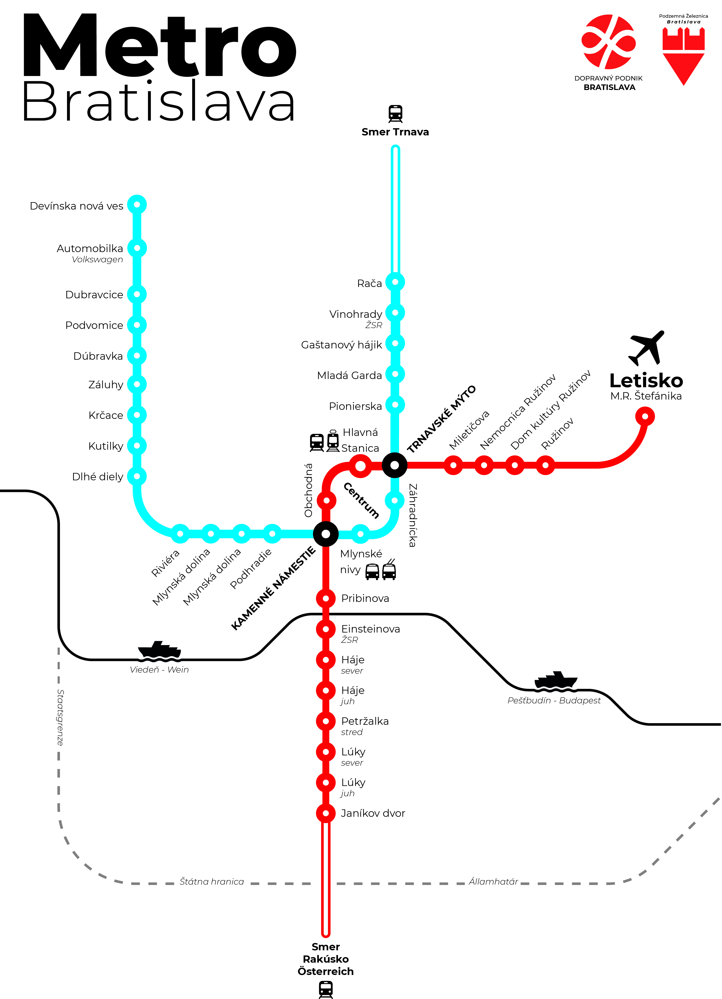
    <i><figcaption>Map of metro in Bratislava. Taken from <a href="https://i.redd.it/y7u87gu5px021.jpg">Reddit</a>.</figcaption></i>
  </figure >

- Polygons
  - Regions
  - Choropleth

<figure class="image">
  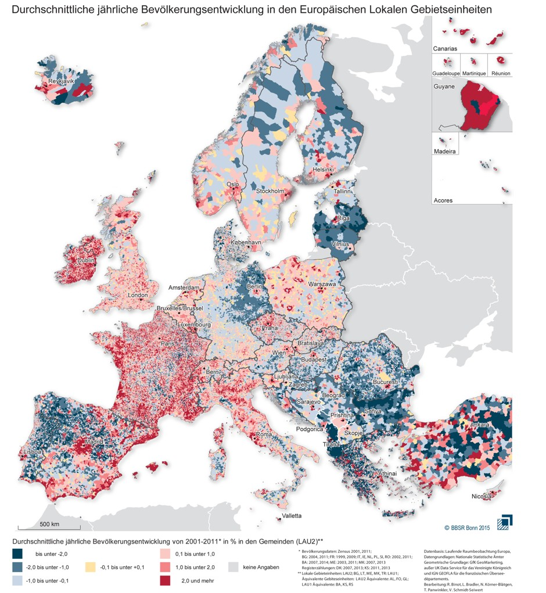
  <i><figcaption>Changes in population within European regions; an example of a choropleth map. Taken from <a href="https://www.bbsr.bund.de/BBSR/DE/startseite/_node.html">BBSR</a>.</figcaption></i>
</figure >

<figure class="image">
  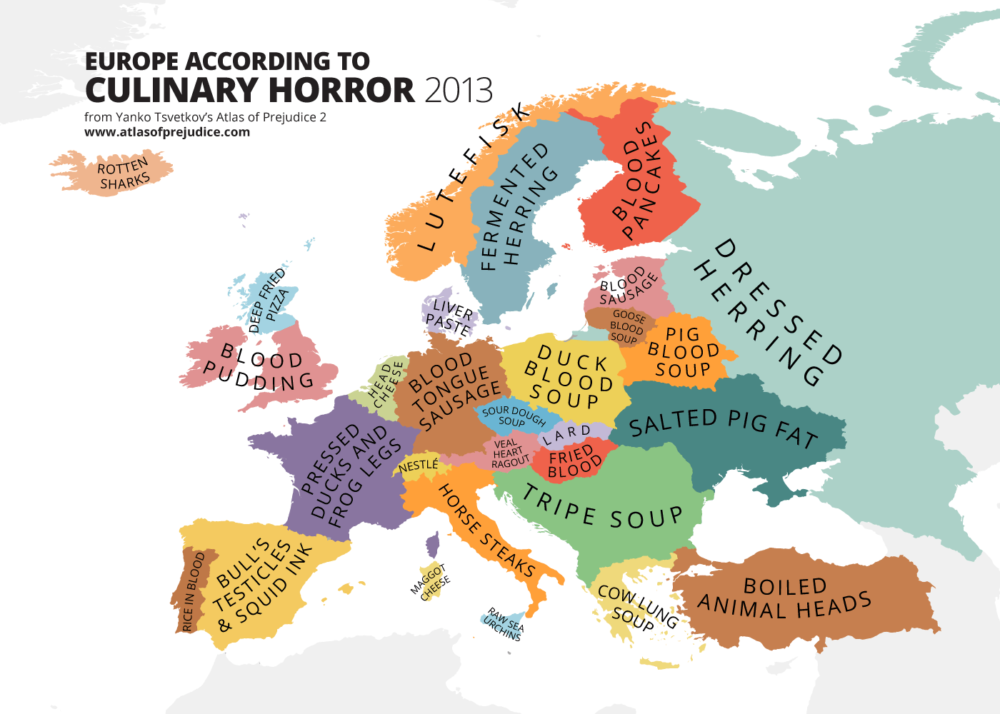
  <i><figcaption>Europe according to Culinary horror 2013; example of polygons as regions. Taken from <a href="hhttps://atlasofprejudice.com/our-collective-eating-disorder-4846eede37bd">Atlas of Prejudice</a>.</figcaption></i>
</figure >

- 3D
<figure class="image">
  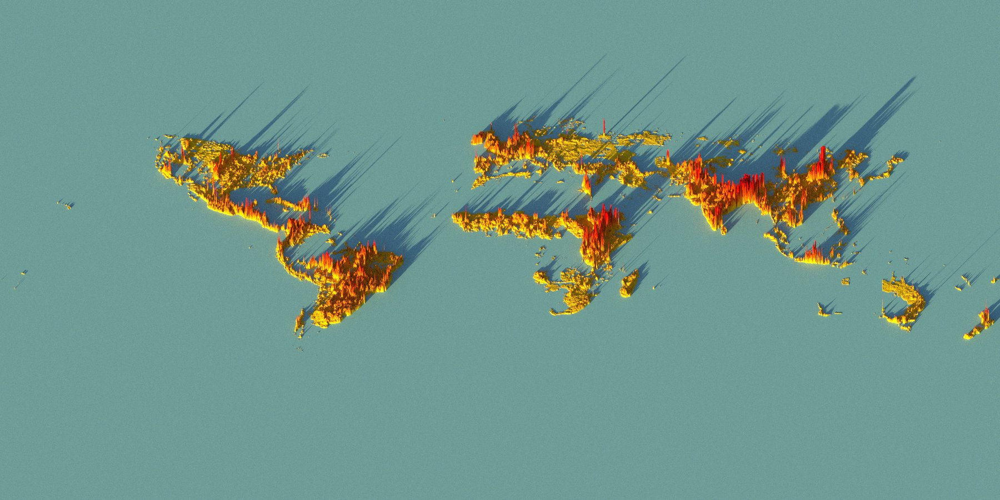
  <i><figcaption> World of cows. Taken from <a href="https://twitter.com/mbeisen/status/1333985436042104832/photo/1">Twitter</a>.</figcaption></i>
</figure >

### Mathematical Cartography, Geographical Coordinates

- Transformation of the Earth`s globe surface into a flat plane with the system of mathematical equations
- This way, we can define every position on the planet / in a region
- WGS (World Geodetic System) - a system of XY coordinates

  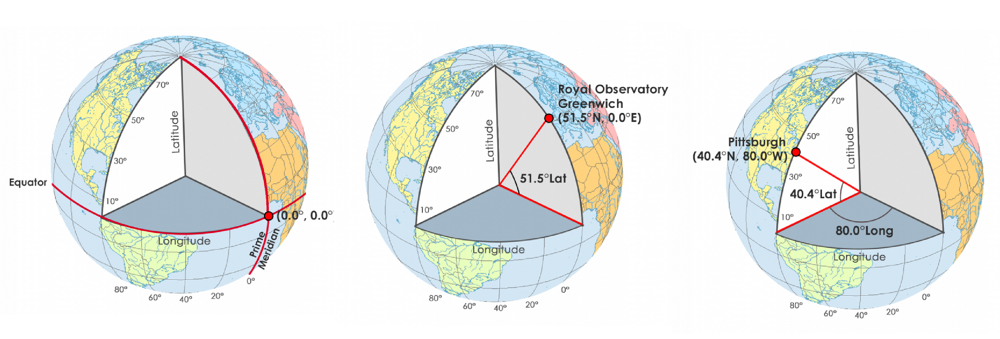

  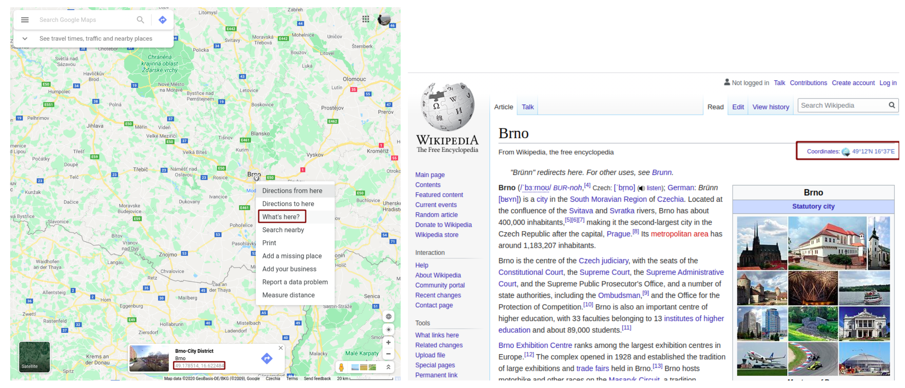

---

## Motivation (Why to be interested in GIS?)

### GIS + X

- Every phenomenon that relates to the geographical space
- There are many fields of human activity that are dependent on GIS.
  - Meteorology
  - Transportation
  - Ecology
  - Urban planning
  - Agriculture
    ...

<figure class="image">
  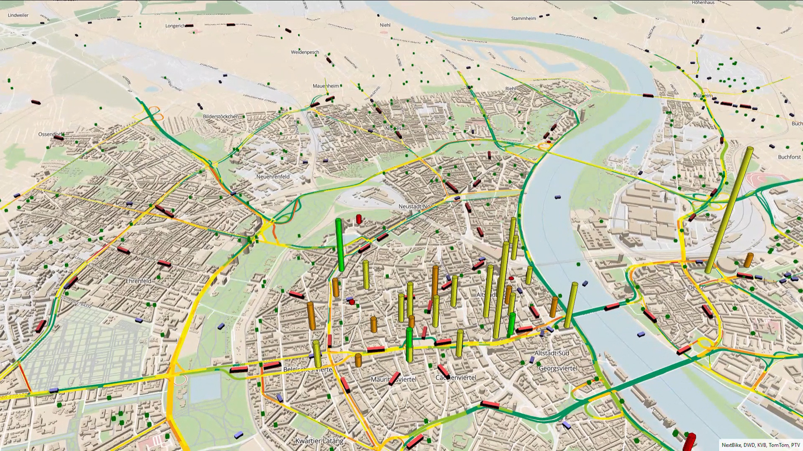
  <i><figcaption>Real time prediction of public transport in the city of Cologne; an example of use of GIS in transportation. Taken from <a href="https://company.ptvgroup.com/fileadmin/Resources/newsroom/Images/Photos_Media_Gallery/PTV_Public_Transport_Cologne.jpg">company.ptvgroup.com</a>.</figcaption></i>
</figure >

<figure class="image">
  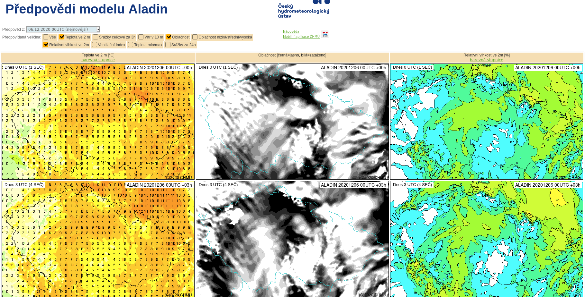
  <i><figcaption>Visualization of the Aladin model on CHMU website; an example of an use of GIS in meteorology. Taken from <a href="chmu.cz">chmu.cz</a>.</figcaption></i>
</figure >

### GIS + Humanitites = Spatial Humanities (Digital Humanities)

- Long tradition of sketching maps in all kind of sciences
- Constraints preventing the full potential of using GIS in Humanities
  - Data quality (validity, uncertainty, incompleteness)
  - Preferences in qualitative approaches
  - Untrust to the generalization process ?
  - Statistical / Mathematical / Programming skills required
- Relevant practical GIS tasks in the area of Digital Humanities
  - Geocoding
  - Georeferencing

<figure class="image">
  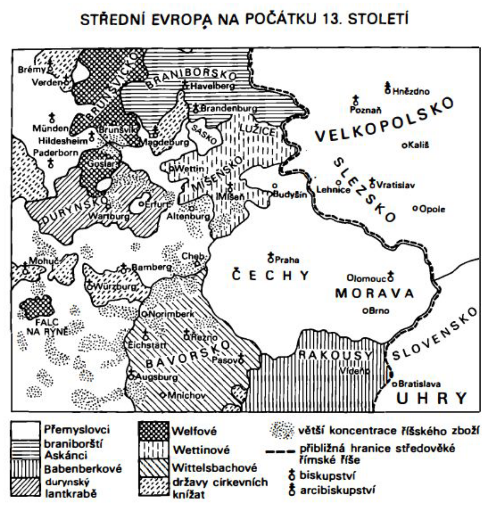
  <i><figcaption>A map of central Europe at the beginning of the 13th century, an example of a map created by a researcher in humanities. Taken from Zemlicka 1990.</figcaption></i>
</figure>
<figure class="image">
  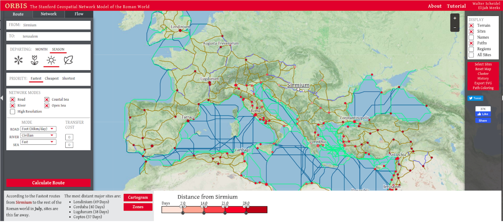
  <i><figcaption><a href="https://orbis.stanford.edu/">ORBIS</a> application that calculates travelling costs and times in the Roman times.</figcaption></i>
</figure>

---

## Practical Example

### 1. Create point-layer dataset and export it as .csv

- Create a new table in MS Excel, LibreOffice Calc, Google Spreadsheets...
- Rows are records, columns are variables
- Two columns for geographic coordinates - name it e.g., X and Y
- Define value domains for each column - e.g., column "label" is a text, column "certainty" is a boolean (TRUE, FALSE values), and column "price" is a number

<figure class="image">
  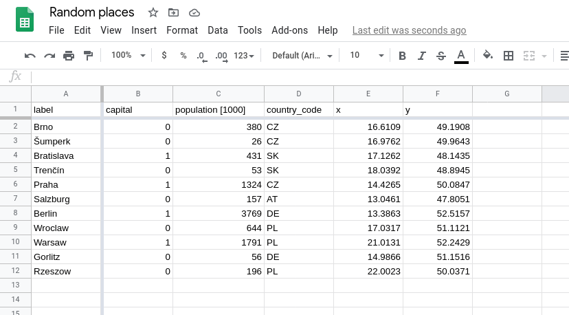
</figure>

### 2. Import .csv dataset into QGIS

- Run QGIS and create a new Project
- `Open Data Source Manager` (Ctrl + L) and choose `Delimited Text`
- Select the .csv file into the first input (`File Name`)

<figure class="image">
  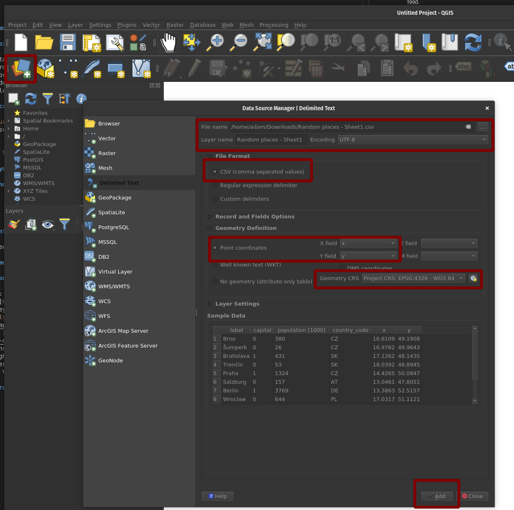
</figure>

### 3. Add base layers

- list of available XYTiles:
  - https://wiki.openstreetmap.org/wiki/Tile_servers
  - https://qms.nextgis.com/#
  - https://www.spatialbias.com/2018/02/qgis-3.0-xyz-tile-layers/
  - https://leaflet-extras.github.io/leaflet-providers/preview/
    - replace {s} with `subdomains` value
  - https://geoportal.cuzk.cz/
    - WMS / WMTS
    - `Služby` -> `Prohlížení`
- some base layers need an additional authentification (`apikey`), some are "down", some are very "slow"
- recommended to start with OSM `https://tile.openstreetmap.org/{z}/{x}/{y}.png`

<figure class="image">
  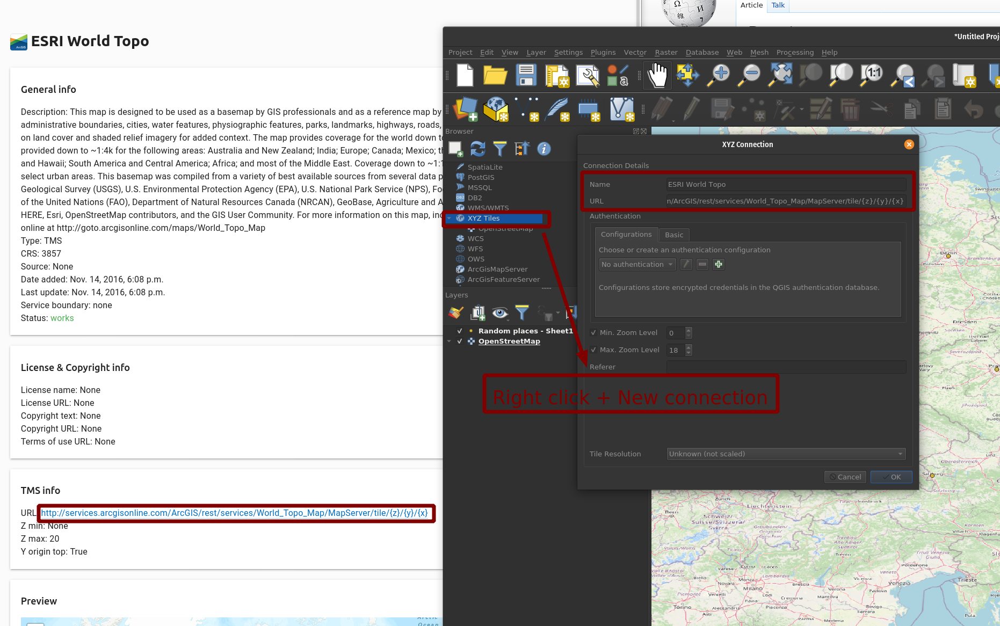
</figure>
<figure class="image">
  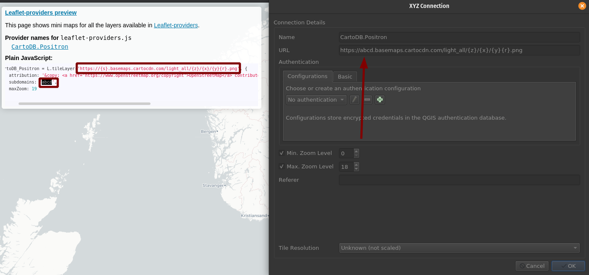
</figure>

### 4. Select symbolization

- Right click on the layer in the `Layers` panel -> `Properties` -> `Symbolization`
- There are several visualization methods to use
  - most basic methods: Graduated (Quantitative data) and Categorized (Qualitative Data)
- Different possibilities for Vector and Raster data

<figure class="image">
  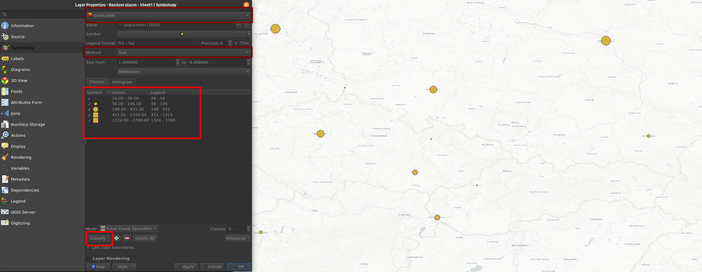
</figure>

<figure class="image">
  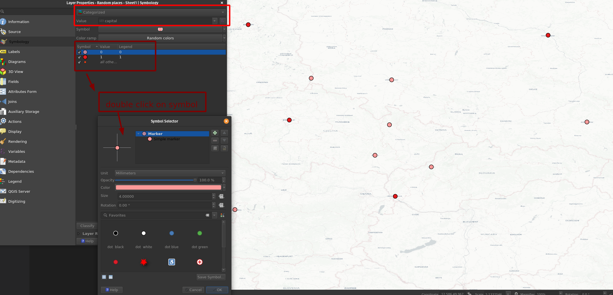
</figure>

<figure class="image">
  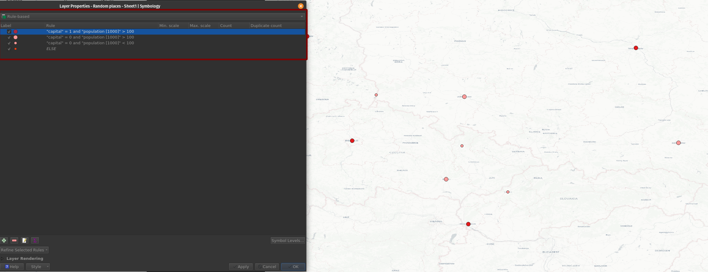
</figure>

### 5. Labels

- Right click on the layer in the `Layers` panel -> `Properties` -> `Labels`
- Choose `Single labels` and select the label attribute in the `Value` form

<figure class="image">
  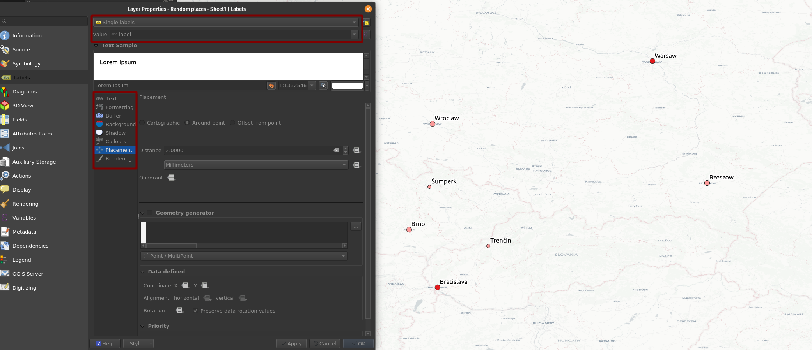
</figure>

### 6. Export and create the map composition

---

## Discussion

### Aditional information

- link to the lecture notes https://adammertel.github.io/GIS-and-humanities/

### Books to read

### Links and Sources

- QGIS: [A Gentle Introduction to GIS](https://docs.qgis.org/3.10/en/docs/gentle_gis_introduction/)
- Manuel Gimond: [Intro to GIS and Spatial Analysis](https://mgimond.github.io/Spatial/index.html)
- UC Berkeley: [GIS data types: Vector VS Raster](http://gif.berkeley.edu/documents/GIS_Data_Formats.pdf)
- David J. Buckey: [GIS Introduction](http://planet.botany.uwc.ac.za/nisl/GIS/GIS_primer/index.htm)
- ICSM: [Commonly used map projections](https://www.icsm.gov.au/education/fundamentals-mapping/projections/commonly-used-map-projections)
- GISGeography: [Degrees/Minutes/Seconds (DMS) vs Decimal Degrees(DD)](https://gisgeography.com/decimal-degrees-dd-minutes-seconds-dms/)
- University Consortium for GIS: [GIS and T Body of Knowledge](https://gistbok.ucgis.org/)
- Jim Vallandingham: [vallandingham.me blog](https://vallandingham.me/)
- Stanford University: [Center for Spatial and Textual Analysis](https://cesta.stanford.edu/)
- University of Virginia Library: [Spatial Humanities Scholars lab](https://spatial.scholarslab.org)

## Homework / Practical Task
