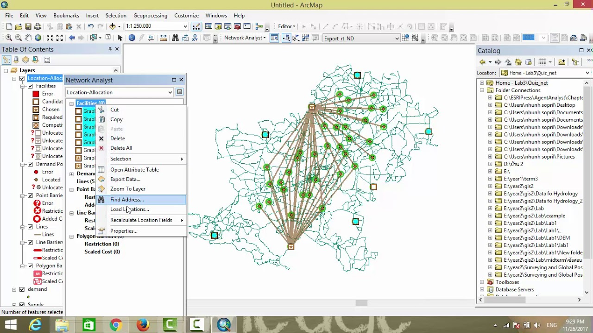
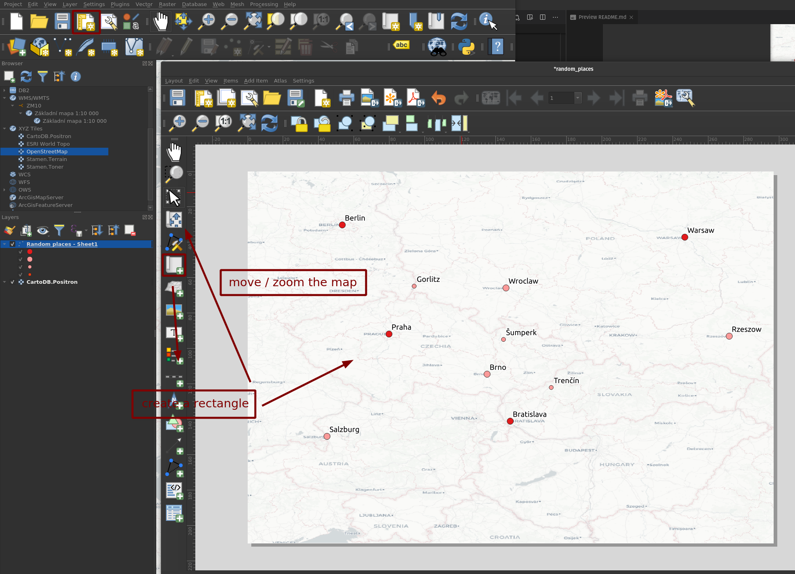
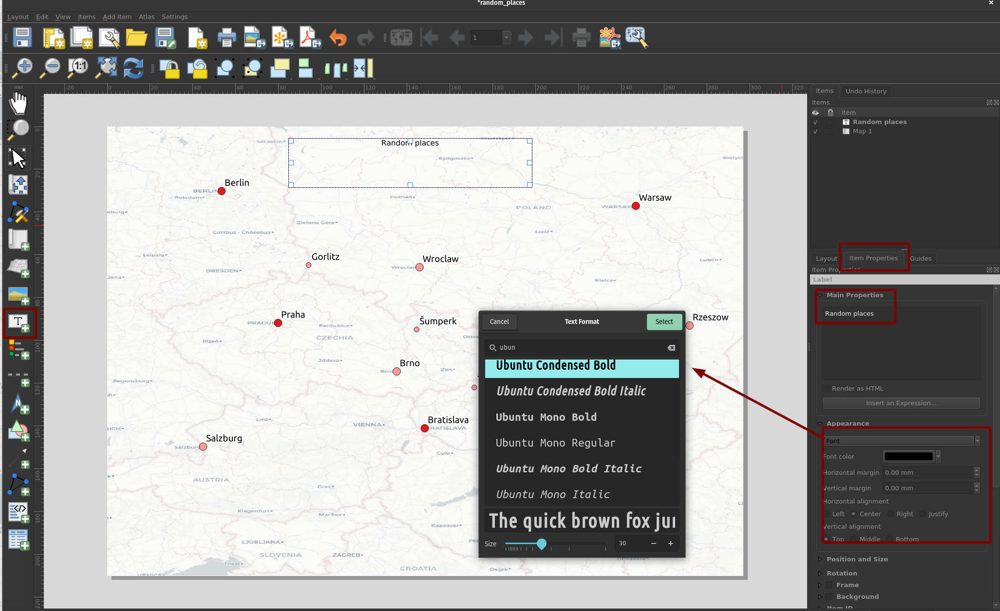
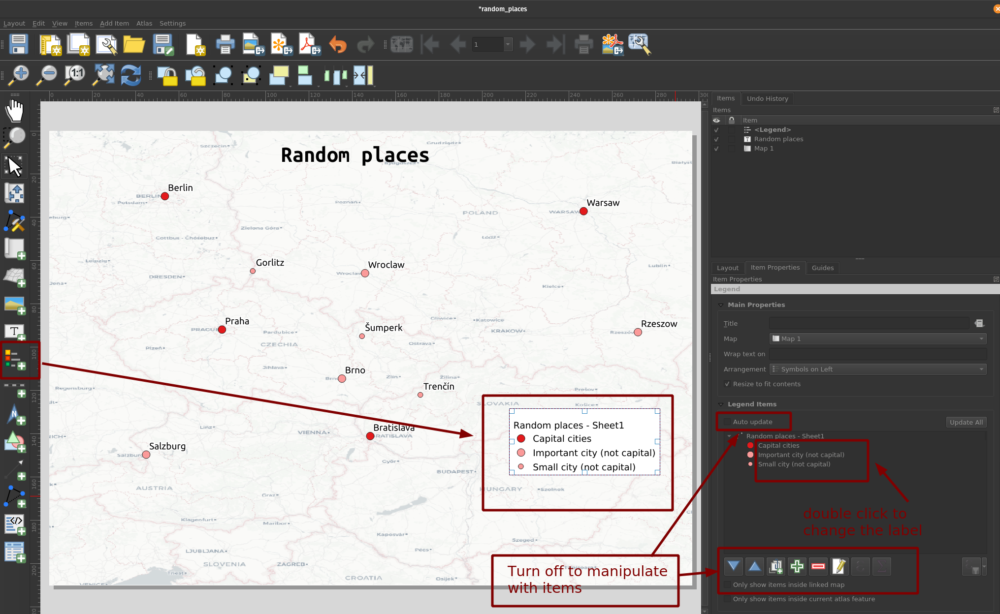
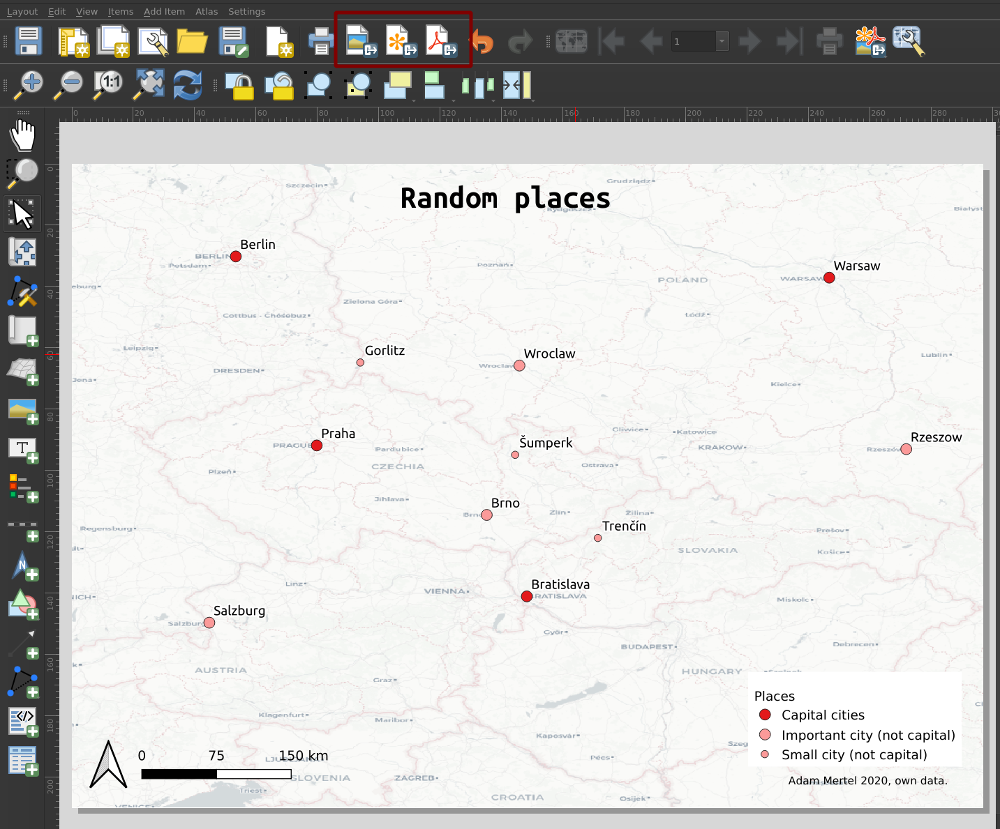

# GIS and Humanities lecture

## Outline

- Introduction to the course
- Basic theory behind GIS
- Motivation
- Practical Example
- Homework
- Discussion

## Introduction to the course

### Main Idea

This webpage is an auxiliary material to the lecture __Spatial data in Humanities__. This lecture is part of the course __ARTS020 - Digital Humanities__ that took place at Masaryk University, Brno, in 2020. This course aims to explain the theoretical basics behind Geographic Information Systems, discuss some examples of their use in Humanities, and provide a short practical example.

### Requirements

- [QGIS](https://www.qgis.org/en/site/) application installed
  - STANDALONE STABLE version is recommended

---

## Basic theory behind GIS

### GIS, Cartography, Geoinformatics, Remote Sensing, Map

- **GIS**

  - An equivalent to "Geospatial"
  - **Geographical Information SCIENCE**

    - Scientific discipline

    <figure class="image">
      
      <i><figcaption>GIS illustration. Taken from <a href="www.esri.com/news/arcnews/winter0809articles/gis-geography-in-action.html">ESRI blog</a>.</figcaption></i>
    </figure >

  - **Geographical Information SYSTEMS**

    - Software / General tools - [ArcGIS](https://www.arcgis.com/index.html), [QGIS](<(https://www.qgis.org/en/site/)>)
    - Built-in systems
    - Frameworks / libraries for data manipulation, visualization...

    <figure class="image">
        
        <i><figcaption>ArcGIS software random screenshot. Taken from <a href="https://www.youtube.com/watch?v=UZDGcIjLISI">Youtube</a>.</figcaption></i>
    </figure >

- **Cartography**

  - "Drawing" and understanding maps - a depiction of the geographical space
  - More historical term
  - Mathematical cartography (how to transform globe to the map), visualization (what is the best way to "draw" our data), theoretical cartography

    <figure class="image">
      
      <i><figcaption>Map of Margraviate of Moravia, made by Komensky in ~1624. Taken from <a href="https://cs.wikipedia.org/wiki/Komensk%C3%A9ho_mapa_Moravy">Wikipedia</a>.</figcaption></i>
    </figure >

- **Geoinformatics**

  - An equivalent to "Geomatics"
  - Heavy use of IT
  - Scripting the methods
  - Spatial data analysis (processing geospatial data), web-based maps (map web applications), Localization services (GPS)

    <figure class="image">
      
      <i><figcaption>Areas of Geoinformatics. Taken from <a href="https://zgis.at/wp-content/uploads/2017/10/MSc-Banner-Waben_1.jpg">zgis.at</a>.</figcaption></i>
    </figure >

- **Remote sensing**

  - Processing images from satellites or airplanes
  - Application in ecology, agriculture, forest management...
  - Detection of changes in forest health, estimation damages after a natural disaster

    <figure class="image">
      
      <i><figcaption>Illustration of Remote Sensing process. Taken from <a href="www.flaticon.com">www.flaticon.com</a> and <a href="https://paititi.info/research-technology/remote-sensing-from-space/">Remote sensing from space</a>.</figcaption></i>
    </figure >

### GIS data sources

- Two types of data

  - **Raster data**

    - Pixel-based / image like datasets
    - Formats - png, tiff, jpg...
    - Spatially continuous information - satellite images, elevation, land cover, temperature
    - Space is divided into pixels, each pixel holds a value / set of values

  - **Vector data**

    - Defined by coordinates / mathematically
    - Formats - shp, geojson, pdf, svg
    - Topology - points, lines, polygons
    - Spatially discrete information - points of interest, rivers / streets / borders, regions

  <figure class="image">
    
    <i><figcaption>A graphical depiction of vector and raster layers.</figcaption></i>
  </figure >

- **Layers**
  <figure class="image">
    
    <i><figcaption>GIS layers.</figcaption></i>
  </figure >

### Spatial Analysis

- Manipulating (filtering, extending, combining) of spatial datasets to extract new information
- Detection of hotspots of crime in the city, predicting temperatures in a set of regions

<figure class="image">
  
  <i><figcaption>Map by Dr. John Snow of London, showing clusters of cholera cases in the 1854 Broad Street cholera outbreak. Taken from <a href="https://en.wikipedia.org/wiki/Spatial_analysis">wikipedia</a>.</figcaption></i>
</figure >

### Visualization of Spatial Data

- **Attribute types**

  - Categorical / Qualitative - dominant crop in the region, name of the local mayor, type of transportation
  - Numerical / Quantitative - average annual temperature, population number
  - Boolean - areas with snow
  - Ordinal - position in a ranking

- **Graphical variables**
  - Size
  - Shape
  - Color hue / value / saturation
  - Orientation

<figure class="image">
  
  <i><figcaption> Visual variables and their ideal use, by Bertin.</figcaption></i>
</figure >

- **Point symbols**
  - Simple - mostly just a symbol that communicates a single value through its size, color, or shape
  - Glyphs - one symbol "communicates" more variables; a complex system of symbolization

<figure class="image">
  
  <i><figcaption>Demography of USA visualized by point symbols. Taken from <a href="https://demographics.virginia.edu/DotMap/">https://demographics.virginia.edu/DotMap/</a>.</figcaption></i>
</figure >
<figure class="image">
  
  <i><figcaption>Example of a map using a multivariate point symbols. Taken from <a href="https://projecteuclid.org/download/pdfview_1/euclid.ss/1199285037">A.-M. Guerry’sMoral Statistics of France: Challenges for MultivariableSpatial Analysis</a>.</figcaption></i>
</figure >

- **Line symbols**

  - Identifications - the feature is generalized by the line; railroads, trails, rivers
  - Borders - the feature is enclosed by the line; regions, areas
  - Movement - the line symbol (arrow) shows the angle that important for the understanding of the feature; wind movement, migration

  <figure class="image">
    
    <i><figcaption>Map of metro in Bratislava. Taken from <a href="https://i.redd.it/y7u87gu5px021.jpg">Reddit</a>.</figcaption></i>
  </figure >

- **Polygons**
  - Regions - all features are on the same level of importance, we just need to define their position; a simple political map
  - Choropleth - features are visualized to represent a quantitative variable

<figure class="image">
  
  <i><figcaption>Changes in population within European regions; an example of a choropleth map. Taken from <a href="https://www.bbsr.bund.de/BBSR/DE/startseite/_node.html">BBSR</a>.</figcaption></i>
</figure >

<figure class="image">
  
  <i><figcaption>Europe according to Culinary horror 2013; example of polygons as regions. Taken from <a href="hhttps://atlasofprejudice.com/our-collective-eating-disorder-4846eede37bd">Atlas of Prejudice</a>.</figcaption></i>
</figure >

- **Heatmap**

  - display the intensity of the phenomenon in space

- **3D**
<figure class="image">
  
  <i><figcaption> World of cows. Taken from <a href="https://twitter.com/mbeisen/status/1333985436042104832/photo/1">Twitter</a>.</figcaption></i>
</figure >

### Mathematical Cartography, Geographical Coordinates

- Transformation of the Earth's globe surface into a flat plane with the system of mathematical equations
- This way, we can define every position on the planet / in a region
- WGS (World Geodetic System) - a system of XY coordinates
- [Cartographic projections playground](https://observablehq.com/@vega/vega-lite-cartographic-projections)

  

  

---

## Motivation (Why to be interested in GIS?)

### GIS + X

- Every phenomenon that relates to the geographical space
- There are many fields of human activity that are dependent on GIS.
  - Meteorology
  - Transportation
  - Ecology
  - Urban planning
  - Agriculture
    ...

<figure class="image">
  
  <i><figcaption>Real time prediction of public transport in the city of Cologne; an example of use of GIS in transportation. Taken from <a href="https://company.ptvgroup.com/fileadmin/Resources/newsroom/Images/Photos_Media_Gallery/PTV_Public_Transport_Cologne.jpg">company.ptvgroup.com</a>.</figcaption></i>
</figure >

<figure class="image">
  
  <i><figcaption>Visualization of the Aladin model on CHMU website; an example of an use of GIS in meteorology. Taken from <a href="chmu.cz">chmu.cz</a>.</figcaption></i>
</figure >

### GIS + Humanitites = Spatial Humanities (Digital Humanities)

- Long tradition of sketching maps in all kind of sciences
- Constraints:
  - Data quality (validity, uncertainty, incompleteness)
  - Preferences in qualitative approaches
  - Untrust to the process of generalization (?)
  - Statistical / Mathematical / Programming skills required
  - ...

<figure class="image">
  
  <i><figcaption>A map of central Europe at the beginning of the 13th century, an example of a map created by a researcher in humanities. Taken from Zemlicka 1990.</figcaption></i>
</figure>
<figure class="image">
  
  <i><figcaption><a href="https://orbis.stanford.edu/">ORBIS</a> application that calculates travelling costs and times in the Roman times.</figcaption></i>
</figure>

---

## Practical Example

- [QGIS manual](https://docs.qgis.org/3.16/en/docs/training_manual/index.html)
- [Czech QGIS tutorial by GISMentors](https://training.gismentors.eu/qgis-zacatecnik/)

### 1. Create point-layer dataset and export it as .csv

- Create a new table in MS Excel, LibreOffice Calc, Google Spreadsheets...
- Rows are records; columns are variables
- Two columns for geographic coordinates - X and Y
- Define value domains for each column - e.g., column "label" is a text, column "certainty" is a boolean (TRUE, FALSE values), and column "price" is a number
- Fill the values for each record based on the defined domains

<figure class="image">
  
</figure>

### 2. Import .csv dataset into QGIS

- Run QGIS and create a new Project
- `Open Data Source Manager` (Ctrl + L) and choose `Delimited Text`
- Select the .csv file into the first input (`File Name`)

<figure class="image">
  
</figure>

### 3. Add base layers

- list of available XYTiles:
  - https://wiki.openstreetmap.org/wiki/Tile_servers
  - https://qms.nextgis.com/#
  - https://www.spatialbias.com/2018/02/qgis-3.0-xyz-tile-layers/
  - https://leaflet-extras.github.io/leaflet-providers/preview/
    - replace {s} with `subdomains` value
  - https://geoportal.cuzk.cz/
    - WMS / WMTS
    - `Služby` -> `Prohlížení`
- some base layers need an additional authentification (`apikey`), some are "down", some are very "slow"
- recommended to start with OSM `https://tile.openstreetmap.org/{z}/{x}/{y}.png`

<figure class="image">
  
</figure>
<figure class="image">
  
</figure>

### 4. Select symbolization

- Right-click on the layer in the `Layers` panel -> `Properties` -> `Symbolization`
- There are several visualization methods to use
  - most basic methods: Graduated (Quantitative data) and Categorized (Qualitative Data)
- Different possibilities for Vector and Raster data

<figure class="image">
  
</figure>

<figure class="image">
  
</figure>

<figure class="image">
  
</figure>

### 5. Labels

- Right click on the layer in the `Layers` panel -> `Properties` -> `Labels`
- Choose `Single labels` and select the label attribute in the `Value` form

<figure class="image">
  
</figure>

### 6. Export and create the map composition

- `New layout` (Ctrl + P) -> Enter name
- Add map components to the layout - title, texts, images, scales, legend...
  - Try to explain, "What information do you want to give to the readers." Ideally, try to show something that would be "hidden" without the map

<figure class="image">
  
</figure>
<figure class="image">
  
</figure>
<figure class="image">
  
</figure>
<figure class="image">
  
</figure>

---

## Homework

- Create a map composition in QGIS to display your spatial (point-based) dataset
  - Its recommended to use any graphical editor (yes, also MS Paint) to finish the composition
  - Data should come from your study, research, your interest - anything that you have some insight into. This insight is crucial for interpreting the map.
  - Before creating the map, think about the main idea (spatial pattern) you want to communicate. And based on this, choose the visualization method and other map components wisely
  - After you create the map - show it to someone without any explanation to see whether he/she understands your "message". If not, think about a better way to communicate that "message."
  - At the end - add a free-form text to the map composition where you describe the map, the dataset, and the reasoning behind that process (3-5 sentences...).

## Discussion

### Aditional information

- link to the lecture notes https://adammertel.github.io/GIS-and-humanities/

### Links and Sources

- QGIS: [A Gentle Introduction to GIS](https://docs.qgis.org/3.10/en/docs/gentle_gis_introduction/)
- Manuel Gimond: [Intro to GIS and Spatial Analysis](https://mgimond.github.io/Spatial/index.html)
- UC Berkeley: [GIS data types: Vector VS Raster](http://gif.berkeley.edu/documents/GIS_Data_Formats.pdf)
- David J. Buckey: [GIS Introduction](http://planet.botany.uwc.ac.za/nisl/GIS/GIS_primer/index.htm)
- ICSM: [Commonly used map projections](https://www.icsm.gov.au/education/fundamentals-mapping/projections/commonly-used-map-projections)
- GISGeography: [Degrees/Minutes/Seconds (DMS) vs Decimal Degrees(DD)](https://gisgeography.com/decimal-degrees-dd-minutes-seconds-dms/)
- University Consortium for GIS: [GIS and T Body of Knowledge](https://gistbok.ucgis.org/)
- Jim Vallandingham: [vallandingham.me blog](https://vallandingham.me/)
- Stanford University: [Center for Spatial and Textual Analysis](https://cesta.stanford.edu/)
- University of Virginia Library: [Spatial Humanities Scholars lab](https://spatial.scholarslab.org)
